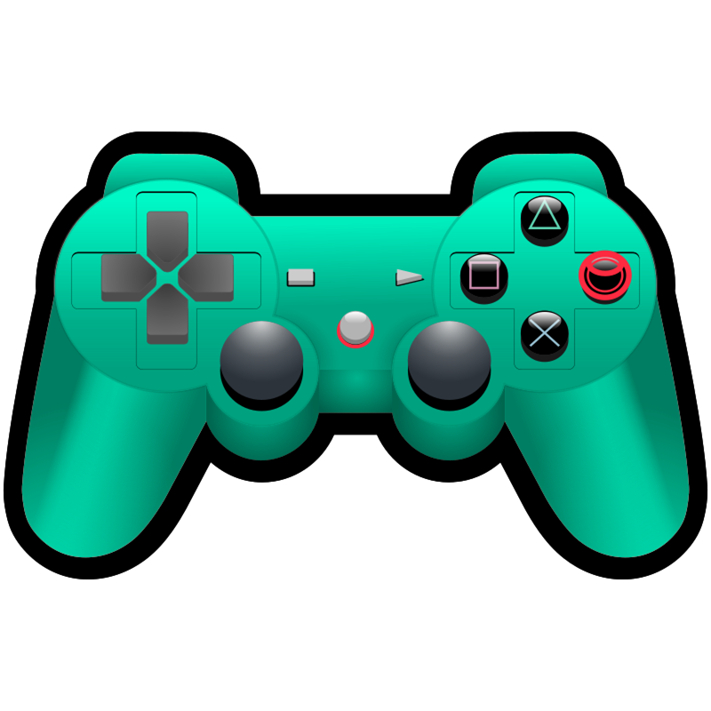

# My collections 

WORK IN PROGRESS
Should allow to manage a library of games/books/anything with very simple maintenance.
I was using markdown in the beginning, but didn't like that solution, so I switched to a JSON database to make it more simple.
The github pages are taking the information directly from the JSON file so I don't need to modify each page every time.

> [!NOTE]
> This project is a bit far from being finished, so you might encounter some errors
> Such as : bad links, typo errors, visual glitches, etc
> Feel free to submit an issue if you want, it'll help me keeps things clean

| Games | Books | Music |
| --- | --- | --- |
|    |  | [Music](music/music.md)

